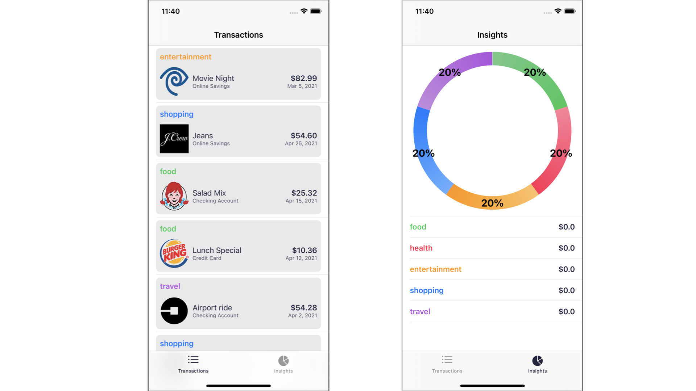
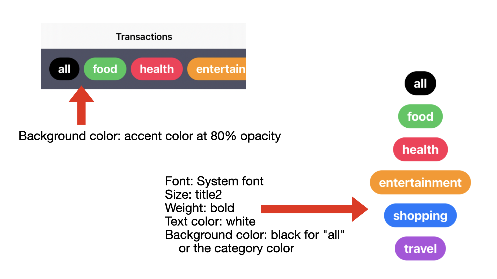
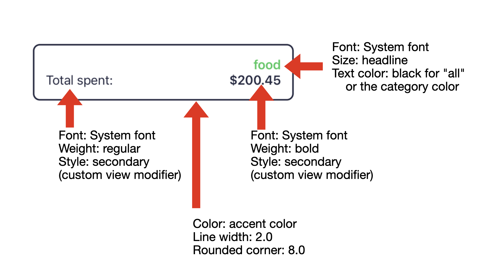
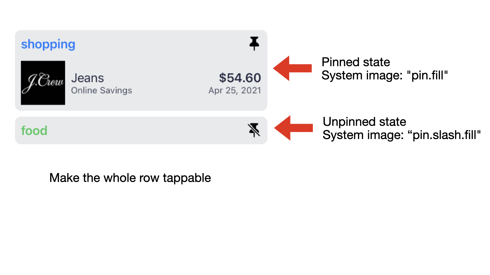
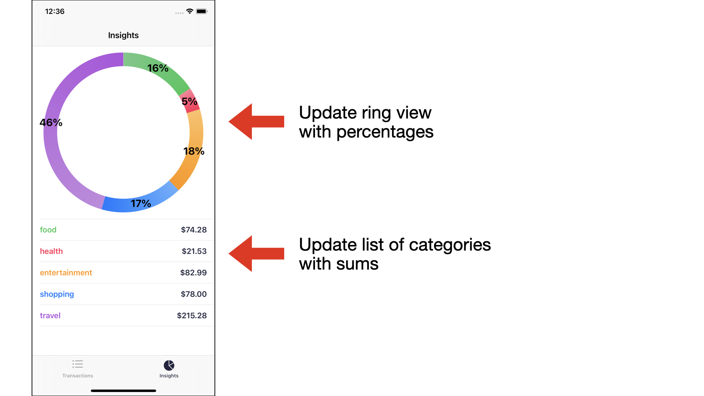

# iOS Tech Challenge - Take Home Challenge

## Change Details:
- Refactored to support MVVM with Repository design pattern.
- Added unit tests for ViewModels.
- Added CategoryGridView to allow filtering transaction basing upon the selected category.
- Added TotalSumView to show floating sum view.
- Added support to pin/unpin transactions.
- Updated InsightView to reflect the transactions information basing upon the pinned/unpinned transactions. 

## Preparation 
Please, compile the project in Xcode and run it in your simulator of choice. You will find a working app prototype with 2 screens, accessible via the tab bar. This is the starting point for the challenge.

Back in the project, locate the file `TransactionModel.swift` and have a look at the data model driving the app, the `TransactionModel`. Some sample transactions can be found in `ModelData.swift`. These are used to populate the list of transactions you have just seen.

## Assignments

General points to consider:
- follow the specs carefully
- focus on writing clean, maintainable code
- write your UI code in SwiftUI, not UIKit

### 1. Filtering buttons

Add a horizontally scrolling view with buttons for the different categories (shopping, entertainment, food, etc). When the user taps on each of these, the list below should show only the transactions for the selected category. Add a button for all categories as well.

Play the following video to see the feature in action (note: if seeing inside Xcode video may not show fully):

Here are the design specs for the scrolling list of buttons and the buttons themselves:

### 2. Floating sum view 

Add a floating view at the bottom of the list displaying the sum for the transactions belonging to the selected category. The sum should update when the user chooses the different categories.

Play the following video to see the feature in action:

Here are the design specs for the floating view with the sum of the chosen transactions:

### 3. Add a pin/unpin action to each transaction

By tapping on it, the UI should blend/unblend accordingly. The sum in the floating view at the bottom should only consider pinned transactions.

Play the following video to see the feature in action:

Here are the design specs for the unpinned transaction view and the pin/unpin icon:

### 4. Update the chart and list in the insights tab to reflect expense in each category

The insights view should only consider pinned transactions.

Make sure that the state between the transactions and the insights tab is kept consistent, as shown in this video capture:

### 5. Unit tests 

Write unit test to verify:

- filtering of transactions according to category
- sum of transaction amounts for filtered category

## Wrapping up

Once you have completed the assignments, please follow the instructions provided. Please, make sure that your project is complete and it is ready to be compiled and tested using the latest stable version of Xcode.

Good luck!
